# The Market Forces of Supply and Demand

## 4.1 Markets and Competition

### 4.1a What is a Market?

market
: a group of buyers and sellers of a particular good or service

### 4.1b What is Competition?

competitive market
: a market in which there are many buyers and many sellers so that each has a negligible impact on the market price

在这章中，我们做一点理想化的假设：

**perfectly competitive**:
- The goods offered for sale are all exactly the ==same==
- The buyers and sellers are so numerous that ==no single buyer or seller has any influence over the market price==

> Because buyers and sellers in perfectly competitive markets ==must accept the price== the market determines, they are said to be **price takers**

---

显然，并不可能所有的市场都是perfectly competitive的。到了另一个极端的时候：

monopoly [məˈnɑpəli]
: some markets have only one seller, and this seller sets the price

垄断太常见了

## 4.2 Demand 

### 4.2a The Demand Curve: The Relationship between Price and Quantity Demanded

quantity demanded
: the amount of a good that buyers are willing and able to purchase

虽然说有很多因素会影响需求量，但是价格的影响最为普遍：

law of demand
: other things being equal, the quantity demanded of a good falls when the ==price== of the good rises

---

接下来见一下两种展示方法：

demand schedule
: a table that shows the relationship between the price of a good and the quantity demanded

demand curve
: a graph of the relationship between the price of a good and the quantity demanded

<!-- 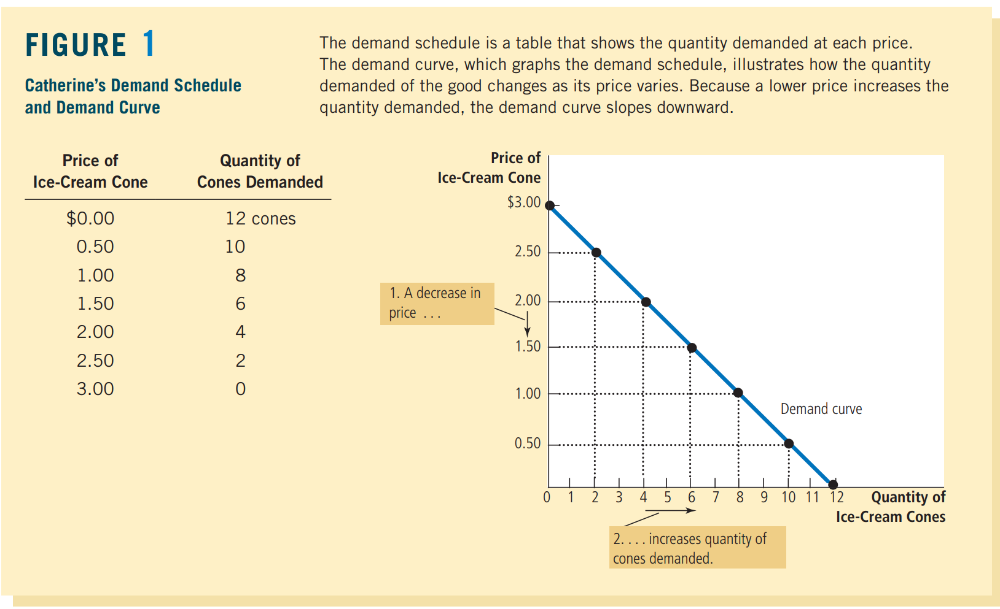 -->

### 4.2b Market Demand VS Individual Demand

market demand
: the sum of all the individual demands for a particular good or service

<!-- 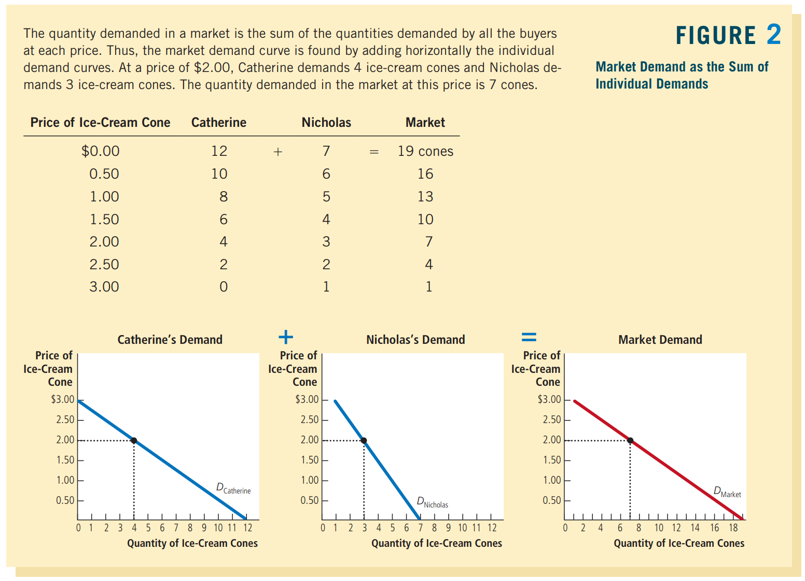 -->

### 4.2c Shifts in the Demand Curve

<!-- 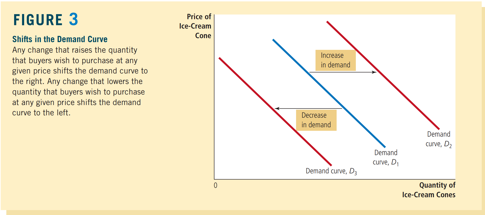 -->

左移需求量降低，右移增多

有很多因素可以引起需求曲线移动：

#### 4.2c.1 Income

normal good
: a good for which, other things being equal, an increase in income leads to an ==increase== in demand

inferior good
: a good for which, other things being equal, an increase in income leads to a ==decrease== in demand

e.g.

bus rides (收入变高了就不做公交车了)

#### 4.2c.2 Prices of Related Goods

substitutes
: two goods in which an increase in the price of one leads to an ==increase== in the demand for the other

e.g.

hot dogs & hamburgers的需求反方向变化

complements
: two goods in which an increase in the price of one leads to an ==decrease== in the demand for the other

e.g.

汽车和汽油的需求同方向变化

#### 4.2c.3 Tastes

因为过于玄学，所以经济学家也没法解释这种喜好。然而，他们会解释taste改变的时候会发生什么

#### 4.2c.4 Expectations

> Your ==expectations about the future== may affect your demand for a good or service today

#### 4.2c.5 Number of Buyers

假如买雪糕的人多了，需求量当然是变大了

## 4.3 Supply

看完了需求侧，现在来看看供给侧

### 4.3a The Supply Curve: The Relationship between Price and Quantity Supplied

quantity supplied
: the amount of a good that sellers are willing and able to sell

非常类似地，价格依旧是关键因素：

law of supply
: other things being equal, the quantity supplied of a good rises when the price of the good rises

<!-- 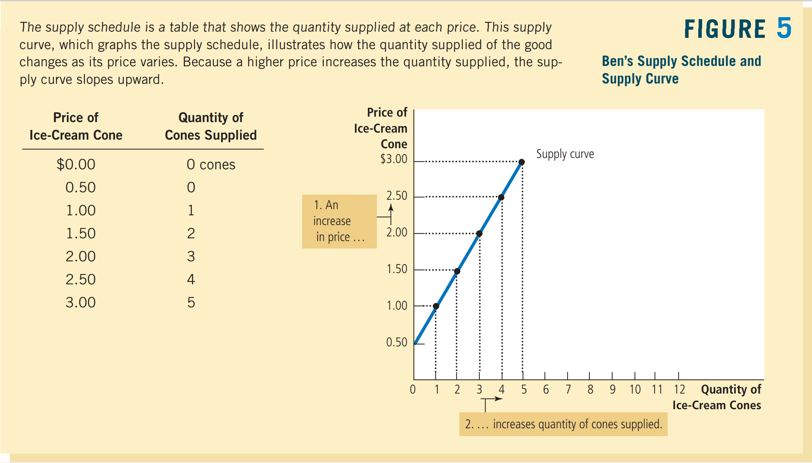 -->

相似地，图中有**supply schedule**和**supply curve**两个概念

### 4.3b Market Supply VS Individual Supply

市场供给同样是所有个体供给之和

<!-- 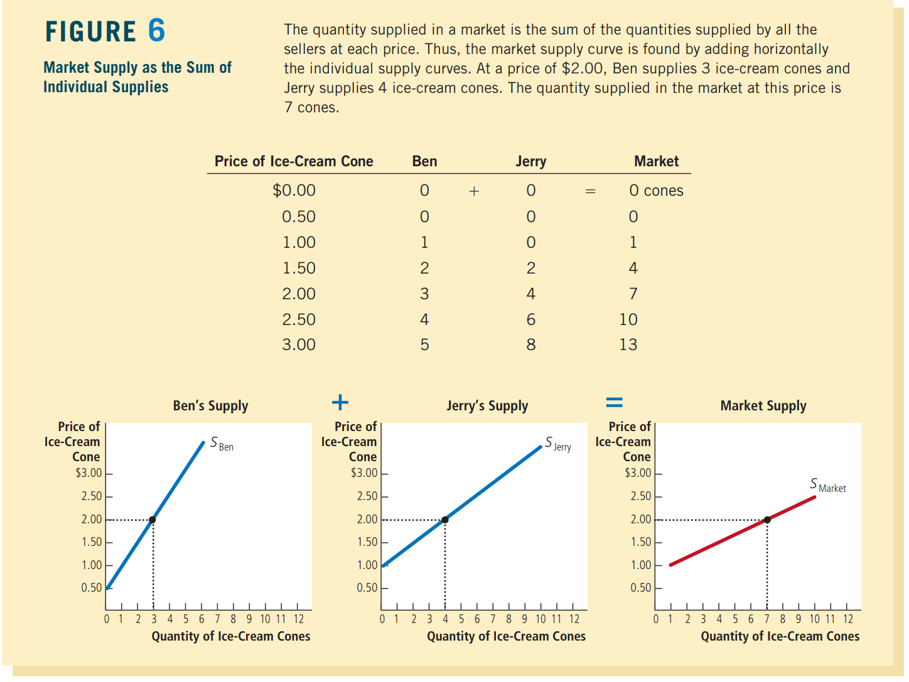 -->

### 4.3c Shifts in the Supply Curve

<!-- 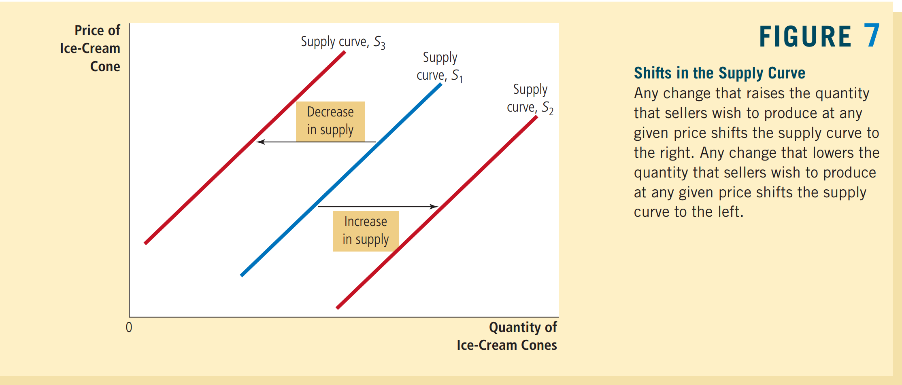 -->

似曾相识

同样来看看哪些因素影响供给曲线:

#### 4.3c.1 Input Prices

> the supply of a good is ==negatively related== to the price of the inputs used to make the good

#### 4.3c.2 Technology

> By reducing firms’ costs, the advance in technology raised the supply of ice cream.

#### 4.3c.4 Expectations

e.g.

if a firm expects the price of ice cream to rise in the future, it will put some of its current production into storage and supply less to the market today.

#### 4.3c.4 Number of Sellers

供应商少了，供给当然降低

## 4.4 Supply and Demand Together

### 4.4a Equilibrium

<!-- 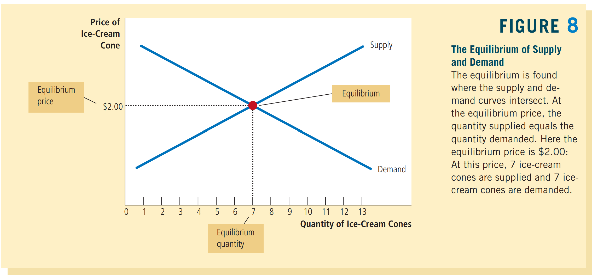 -->

交点即是**equilibrium**，对应的价格为**equilibrium price**，数量为**equilibrium quantity demanded**

equilibrium price也叫做**market-clearing price**，因为供给和需求数量正好相同

---

> The actions of buyers and sellers naturally ==move markets toward the equilibrium== of supply and demand.

至于说为什么会倾向于平衡，不妨考虑下不平衡的情况

surplus
: a situation in which quantity supplied is greater than quantity demanded

也叫**excess supply**

shortage
: a situation in which quantity demanded is greater than quantity supplied

也叫**excess demand**

<!-- 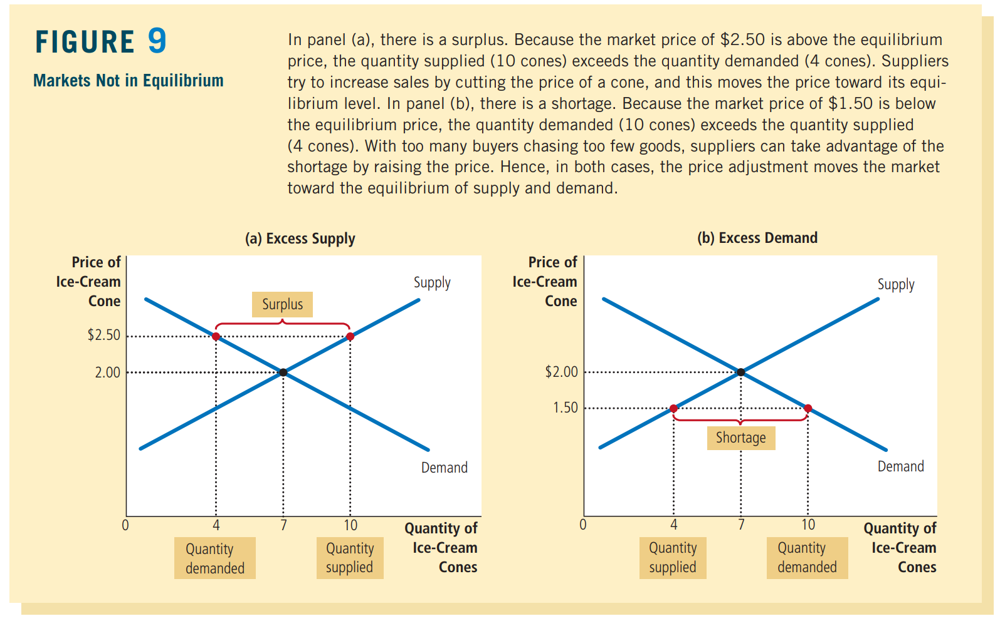 -->

这玩意有个更加正式的定理

law of supply and demand
: the claim that the price of any good adjusts to bring the quantity supplied and the quantity demanded for that good into ==balance==

### 4.4b Three Steps to Analyzing Changes in Equilibrium

Three Steps for Analyzing Changes in Equilibrium:
- Decide whether the event shifts the supply or demand curve (or perhaps both).
- Decide in which direction the curve shifts.
- Use the supply-and demand diagram to see how the shift changes the equilibrium price and quantity.

需求变化：

<!-- 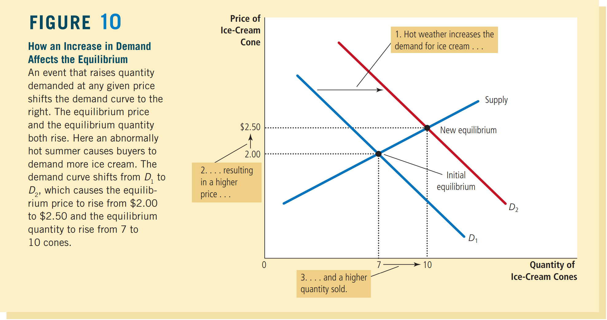 -->

供给变化：

<!-- 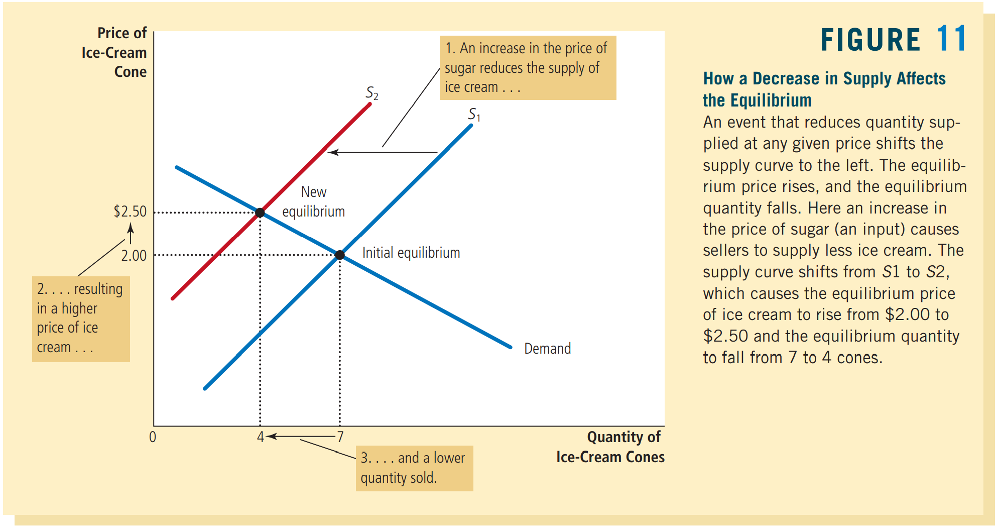 -->

都变化：

<!-- 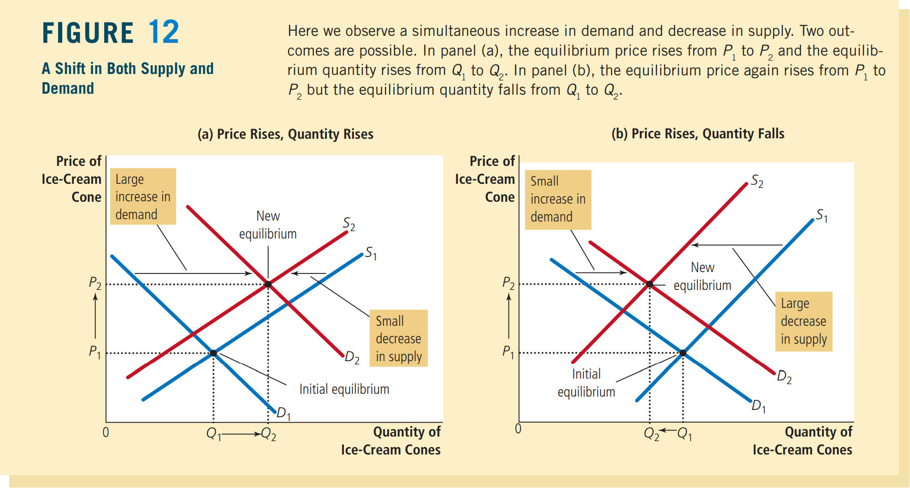 -->

用更加不直观的表格总结下：

<!-- 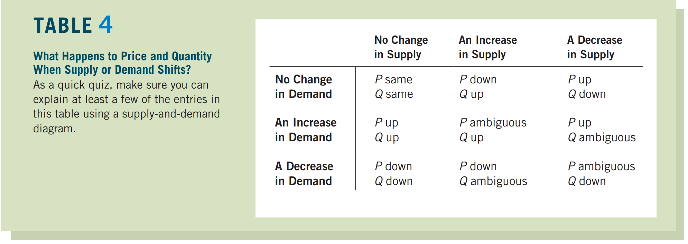 -->

## 4.5 Conclusion: How Prices Allocate Resources

价格间接影响了稀缺资源的分配

P120讨论了自然灾害期间涨价是否是合理的。结论反正是合理，因为能比限制价格更加有效地维护公平（听起来确实挺反直觉的）

