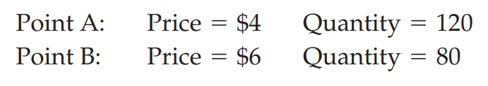
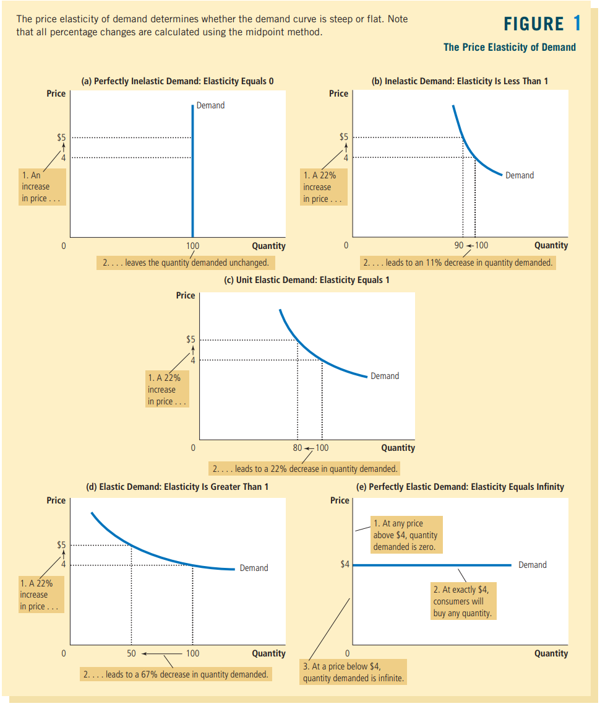
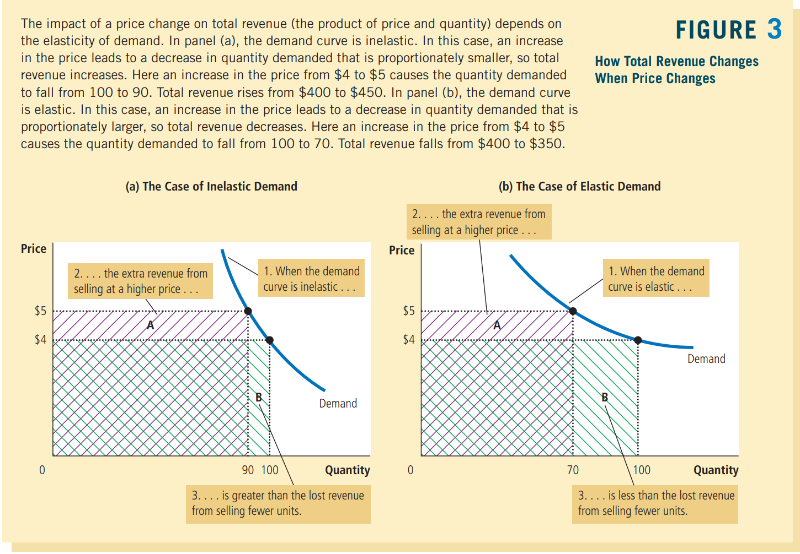
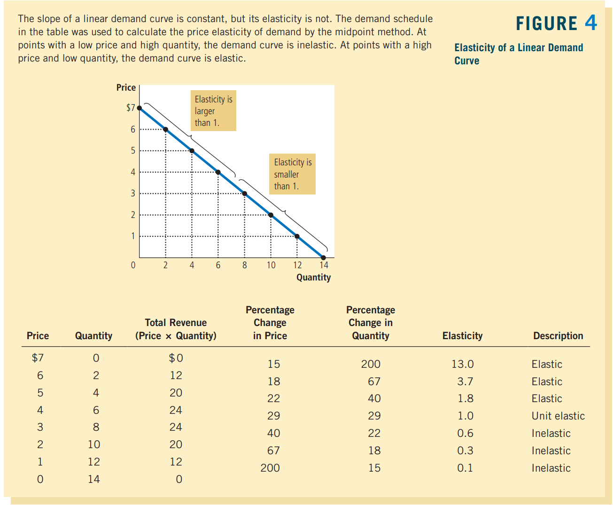

# Elasticity and Its Application

之前的分析其实都是定性分析（只确定变化方向），而定量分析则需要用到elasticity

elasticity
: a measure of the responsiveness of quantity demanded or quantity supplied to a change in one of its determinants

## 5.1 The Elasticity of Demand

### 5.1a The Price Elasticity of Demand and Its Determinants

price elasticity of demand
: a measure of how much the quantity demanded of a good responds to a change in the price of that good, computed as the percentage change in quantity demanded divided by the percentage change in price ($\frac{\Delta\text{Demand}}{\Delta \text{Price}}$)

这个比值的结果可以导致不同的评价：
- elastic

    : Demand for a good is said to be **elastic** if the quantity demanded responds ==substantially== to changes in the price

- inelastic

    : Demand is said to be **inelastic** if the quantity demanded responds only ==slightly== to changes in the price

> The price elasticity of demand for any good measures ==how willing== consumers are to buy less of the good as its price rises.

---

虽然说影响elasticity的因素非常多，我们可以基于经验列举一些因素：

- **Availability of Close Substitutes**

    > Goods with ==close substitutes tend to have more elastic demand== because it is easier for consumers to switch from that good to others.
- **Necessities versus Luxuries**

    > Necessities tend to have inelastic demands, whereas luxuries have elastic demands
- **Definition of the Market**

    > The elasticity of demand in any market depends on ==how we draw the boundaries of the market==. ==Narrowly defined markets tend to have more elastic demand than broadly defined markets== because it is easier to find close substitutes for narrowly defined goods

    比如食品这个大类没有替代品，然而冰淇凌有替代品你
- **Time Horizon**

    > Goods tend to have more elastic demand over longer time horizons

    比如油价涨了之后，短期内需求变化可能很小，但是一段时间后大家换成了更加省油的车，需求就减小了

### 5.1b Computing the Price Elasticity of Demand

假如雪糕价格增长了10\%，你买的雪糕的数量会减少20\%

$$
\text{Price elasticity of demand}=\frac{20 \text{ percent}}{10\text{ percent}}=2
$$

也许你会觉得这玩意应该有正负之分，本书统统忽略符号。这样的话，更大的数值就代表了更加responsive

### 5.1c The Midpoint Method: A Better Way to Calculate Percentage Changes and Elasticities

假如我们用上面的这个公式来计算elasticity的话，我们会发现一些很怪异的结果

e.g.

假如我们有两个不同的状态点：

<!--  -->

当从point A变成point B的时候，price elasticity为：
$$
\frac{33\%}{50\%}=0.66
$$

然而，从point B变成point A的时候，price elasticity为：
$$
\frac{50\%}{33\%}=1.5
$$

究其原因是，计算比例的时候base使用的是初始状态，而两种情况下的初始状态并不相同，，导致最终结果不一样

---

想要解决也非常无脑，就是把base变成两点之间的中点

假设两点分别为$(Q_1,P_1)$和$(Q_2,P_2)$:
$$
\text{Price elasticity of demand}=\frac{(Q_2-Q_1)/[(Q_2+Q_1)/2]}{(P_2-P_1)/[(P_2+P_1)/2]}
$$

这样两个方向的计算就相等了

---

尽管看着很科学，但是本书极少这么计算:
> what elasticity represents—the responsiveness of quantity demanded to a change in price—is more important than how it is calculated

### 5.1d The Variety of Demand Curves

[5.1a](#51-the-elasticity-of-demand)这里其实讲过了定性的定义，这里再结合elasticity的定量定义来说明一下具体定义：

elastic
: when the elasticity is greater than 1

which means the quantity 
moves proportionately more than the price.

inelastic
: when the elasticity is less than 1

which means the quantity moves proportionately less than the price

unit elasticity
: If the elasticity is ==exactly 1==, the percentage change in quantity equals the percentage change in price, and demand is said to have **unit elasticity**

---

price elasticity和demand curve的slope是有非常大的联系的:
>  The ==flatter== the demand curve that passes through a given point, the ==greater the price elasticity of demand==. The steeper the demand curve that passes through a given point, the smaller the price elasticity of demand.

反正取5个情况来看就是：

<!--  -->

躺得越平、弹性越高

### 5.1e Total Revenue and the Price Elasticity of Demand

total revenue
: the amount paid by buyers and received by sellers of a good, computed as the price ($P$) of the good times the quantity ($Q$) sold ($\text{revenue} = P\times Q$)

总收益和弹性之间的关系如下：

<!--  -->

- When demand is **inelastic** (a price ==elasticity less than 1==), price and total revenue move in the same direction: If the price increases, total revenue also increases.

    价格变化比数量变化要大，所以总的收入增加
- When demand is **elastic** (a price ==elasticity greater than 1==), price and total revenue move in opposite directions: If the price increases, total revenue decreases.

    价格变化比数量变化小，总收入减少
- If demand is **unit elastic** (a price elasticity exactly ==equal to 1==), total revenue remains ==constant== when the price changes.

    这种情况就是一个完美的反比例函数

!!! note
    你应该注意到了，其实看总的revenue变大还是变小，纯粹就是和反比例函数的曲线相比。越往外的revenue越大

### 5.1f Elasticity and Total Revenue along a Linear Demand Curve

> Even though the slope of a linear demand curve is constant, the elasticity is not. This is true because the **slope** is the ratio of ==changes== in the two variables, whereas the **elasticity** is the ratio of ==percentage changes== in the two variables

那就来看看线性的供给曲线上，弹性是如何变化的：

<!--  -->

图中的规律总结一下就是：

- At points with a ==low price and high quantity==, the demand curve is **inelastic**
- At points with a ==high price and low quantity==, the demand curve is **elastic**

!!! note
    直接和unit elastic的图像对比的话，感觉像是把inelastic的右半部分和elastic的左半部分拼在了一起

