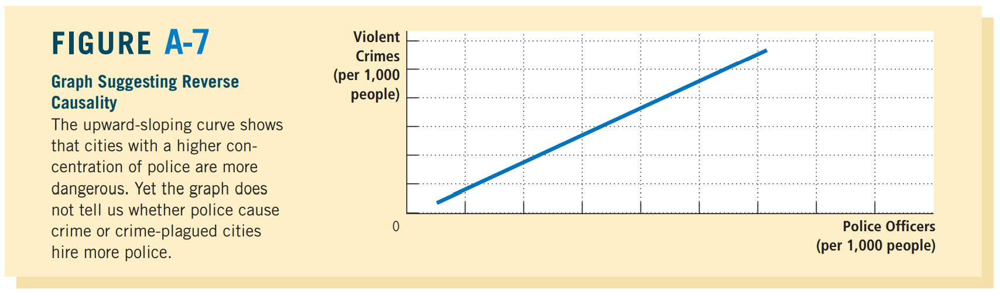

# Thinking Like an Economist

## 2.1 The Economist as Scientist

经济学家其实也会用科学的方法来研究问题：

scientific method
: the dispassionate development and testing of theories about how the world works.

### 2.1a The Scientific Method: Observation, Theory, and More Observation

虽然说和其他学科一样，他们也需要观察和理论之间转换，但是最麻烦的事情是，他们基本没法做实验

所以，研究的时间只能是恰巧已经发生过的事情

### 2.1b The Role of Assumptions

Assumptions can ==simplify== the complex world and make it easier to understand

当然，这些假设必须足够合理就是了，比如对短期和长期的资金流动做出不同的前提假设

### 2.1c Economic Models

mostly consist of ==diagrams and equations==

All models ==simplify reality== to improve our understanding of it

### 2.1d Our First Model: The Circular-Flow Diagram

we need a model that explains ==how the economy is organized== and ==how participants in the economy interact with one another==.

circular model
: a visual model of the economy that shows how dollars flow through markets among households and firms

<!--  -->

注意内层红色箭头和外层红色箭头表示的是两种不同的流动的东西

### 2.1e Our Second Model: The Production Possibilities Frontier

其实大部分的经济学模型，是用数学语言表达的。我们接下来学的就是最简单的一种

production possibilities frontier
: a graph that shows the combinations of output that the economy can possibly produce given the available factors of production and the available production technology

利用现有的资源可以造出来的不同产品 的所有可能情况

e.g.

假设我们只制造两种产品：computer, car

<!--  -->

图中D点可以达到（没完全利用资源），C点不可达到

我们称在frontier上的点是**efficient**的，图形里面的点是**inefficient**的

---

我们可以联系一下上一章学过的其中一个principle:
> The cost of something is what you give up to get it

这叫做*opportunity cost*

The production possibilities frontier shows the *opportunity cost* of one good as ==measured in terms of the other good==

比如上图当中的E点，斜率比较陡，意味着想要生产car就要放弃较多的computer，也就是opportunity cost比较大；相反F就是比较小

---

The production possibilities frontier shows the trade-off between the outputs of different goods at a given time, but the trade-off can ==change over time==

比如说，技术进步使得每个工人能够制造更多computer的时候，图像就会如下改变：

<!--  -->

可以看到x轴交点不变，而y轴交点上移

### 2.1f Microeconomics and Macroeconomics

The field of economics is traditionally divided into two broad subfields：

- Microeconomics

    : the study of how ==households and firms== make decisions and how they interact in markets
- Macroeconomics

    : the study of ==economy-wide== phenomena, including inflation, unemployment, and economic growth

## 2.2 The Economist as Policy Advisor

和2.1的区别是：
- When economics are trying to explain the world, they are **scientists**
- When they are trying to help improve it, they are **policy advisers**

### 2.2a Positive versus Normative Analysis

为了再次区分economics所扮演的两种不同的角色 (scientists/policy advisers)，我们来解释一下用词的区别

比如，两小儿辩minimum-wage laws，你可能听到两种不同的statement:
- **scientists**: Minimum-wage laws cause unemployment.
- **policy advisers**: The government should raise the minimum wage

可以看到两个身份说出来的话，思考的角度是不同的，印证了前面提到的两个身份的区别

In general, statements about the world come in two types:
- positive statements

    : claims that attempt to ==describe== the world as it **is**

    也就是scientists的思路
- normative statements

    : claims that attempt to ==prescribe== how the world should **be**

这俩statement还有个很关键的区别是，positive statement大部分是可以验证他们的合理性的，然而normative statement一般没法验证

### 2.2b Economists in Washington

经济学家知道十个基本原则里包括：
> People face trade-offs

所以他们在描述观点的时候，经常会使用"On the one hand, ...On the other hand,..."

所以Harry Truman (某美国总统) 曾说，恨不得找个one-armed economist (什么冷笑话)

### 2.2c Why Economists' Advice Is Not Always Followed

> Economists offer crucial input into the policy process, but their advice is only ==one ingredient== of a complex recipe

影响的因素太多了，比如说这个方案是否是容易被执行的，是否是容易被大众所理解的，etc

## 2.3 Why Economists Disagree

一般来说有两种基本原因：
- Economists may disagree about the ==validity of alternative positive theories== about how the world works.
- Economists may have different values and therefore ==different normative views== about what government policy should aim to accomplish.

### 2.3a Differences in Scientific Judgments

> Science is an ==ongoing== search to understand the world around us. 

比如很久以前，人们争论日心还是地心；现在，人们争论全球变暖是否正在发生

因此，对于同一件事，不同经济学家对事实的判断就可能产生分歧

比如，假如改变征税的法律，不同经济学家可能对于人们会如何响应这件事，产生不同的观点（是否会刺激存储更多的钱？）

### 2.3b Differences in Values

很多时候，我们并不能够单纯从科学的角度，来判断政策

比如说，Paula的收入低是因为她是残疾人，Peter的收入高是因为他继承了大量遗产，请问在制定税收政策的时候，我应不应该偏袒谁呢？

这种时候就涉及到==价值观==的不同

### 2.3c Perception versus Reality

尽管很多时候大部分经济学家能够达成高度共识，但是政策并没有实际上这样制定

比如说，经济学家基本反对对自由贸易的限制，然后实际上显示依旧存在

为啥理想和现实不同呢？可能是因为政治过程是一种不可消除的障碍；也可能是因为经济学家还无法使得普通公众相信，这些政策是不合意的

这本书的目的之一包括试图说服你经济学家的观点是正确的

<b><h1>Appendix</h1></b>

## Graphing: A Brief Review

用图像一般有两个目的：
- when developing economic theories, graphs offer a way to ==visually express ideas== that might be less clear if described with equations or words
- when ==analyzing== economic data, graphs provide a powerful way of finding and interpreting patterns

### Graphs Of a Single Variable

- **Pie Chart**
- **Bar Graph**
- **Time-Series Graph**

<!--  -->

### Graphs Of Two Variables: The Coordinate System

<!--  -->

散点图，正相关这种概念就不解释了

### Curves in the Coordinate System

介绍经济学中的重要图像：

demand curve
: The **demand curve** trace out the effect of a good's ==price== on the ==quantity== of the good customers want to buy

e.g.

假如我们现在有如下数据表格：

<!--  -->

根据上面的数据，假设收入为\$40000的时候，可以得到如下demand curve:

<!--  -->

可以看到是*negative related*的

假如把所有收入下的图像都画出来的话:

<!--  -->

In economics, it is important to distinguish between **movements along a curve**
and **shifts of a curve**
- **movements along a curve**

    收入不变，价格变化
- **shifts of a curve**

    收入变化

---

那么我们怎么知道，啥时候需要shift a curve呢？
> When a ==relevant variable== that is ==not named on either axis== changes, the curve shifts.

e.g.

Emma的收入假如变化，这显然和购买相关，然而收入这个指标并没有直接体现在x或y坐标上，那么就需要shift

Emma的看书的欲望假如变化，这同样和购买相关，然而坐标轴上也没有直接体现，所以需要shift

### Slope

> To answer questions about ==how much one variable responds to changes in another variable==, we can use the concept of **slope**

比如说，假如曲线非常陡峭的话，Emma不管价格贵不贵都会购买差不多数量的书；假如非常平缓的话，Emma的购买欲望就是大受影响的

显然斜率的定义就是：

$$
\text{slope}=\frac{\Delta y}{\Delta x'}
$$

<!--  -->

### Cause and Effect

现实场景中，因为变量之间的关系错综复杂，所以其实很难做到除了图中的两个变量以外，其它变量都是常量的情况。

比如说，图中的变化其实是由**omitted variable**造成的，而我们并没有察觉

即便我们能分清变量，**reverse causality**也是个大问题。我们可能会觉得$A$导致了$B$，而实际上是$B$导致了$A$

我们现在来具体看看这俩

#### Omitted Variables

比如说，我们想要调查导致癌症的原因的话：

<!--  -->

尽管似乎是打火机的数量和癌症的风险正相关，但是这里有个大问题是：他压根没考虑吸烟的数量，而且吸烟的数量很可能还不是个常量

这里吸烟数量就是个omitted variable

这说明了个重要的道理：
> When you see a graph used to support an argument about cause and effect, it is important to ask whether the movements of an **omitted variable** could explain the results you see

#### Reverse Causality

这次来看看犯罪率和警卫数量之间的关系：

<!--  -->

然而其实并没有证据表明，是犯罪增多导致了警卫增多，还是警卫增多导致了犯罪增多（虽然说常识告诉我们这样似乎不太对）

---

> It might seem that an easy way to determine the direction of causality is to ==examine which variable moves first==

然而事实上这样是非常不靠谱的：
> Often, people change their behavior not in response to a change in their present conditions but in response to a change in their ==expectations of future conditions==

比如说，假如警方预感到即将会有一大堆犯罪来袭，他们就会提前提高警卫数量，这会导致我们得到警卫导致了犯罪的结论

总之，其实并没有一个靠谱的方法，能判定这种关系！

