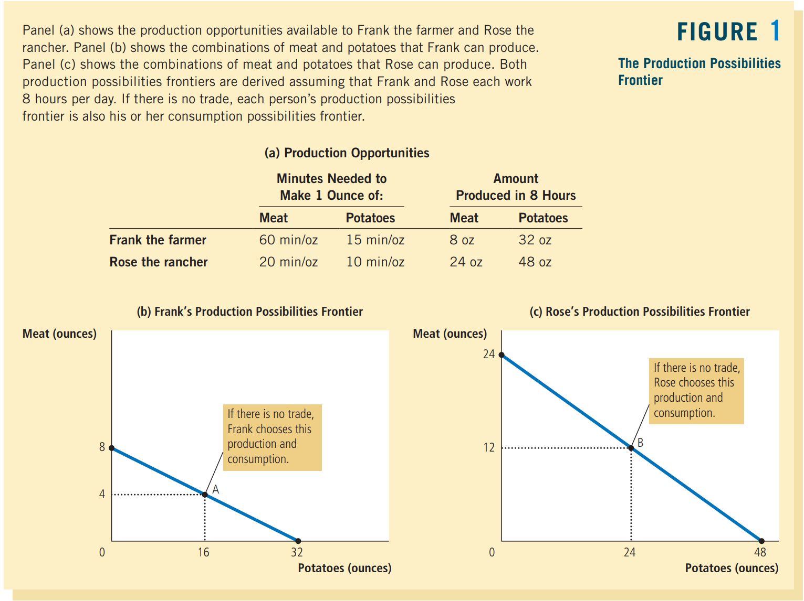
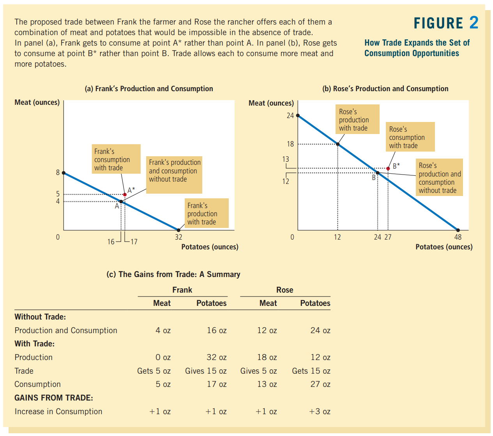
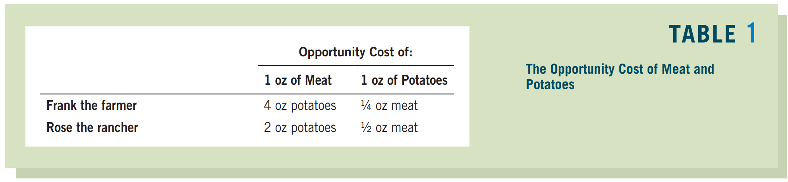

# Interdependence and the Gains from Trade

interdependence
: Every day, you rely on many people, most of whom you have never met, to provide you with the goods and services that you enjoy

根据之前学过的十个原则之一：
> Trade can make everyone better off

我们将会更加细致地来说明这个原则

## 3.1 A Parable for the Modern Economy

假如每个人可以制造所有东西，然而存在某个人，在==任何一个领域==的制造都更加的高效，这时候进行交易是否是合理的？

为了回答这个问题，我们将要更加细致地了解影响这个决定的因素

### 3.1a Production Possibilities

假设Frank和Rose各自每天工作8小时，两人都生产meat和potato，然而Rose的生产效率都高于Frank:

<!--  -->

也许你会记得，在[Ch2](Ch2_Thinking_Like_an_Economist.md#21e-our-second-model-the-production-possibilities-frontier)里面，production possibilities frontier是向外突出的
> In that case, the rate at which society could trade one good for the other ==depended on the amounts that were being produced==

然而神奇的Frank可以保证在任何时候，用生产一个产品的时间来生产另一个产品的比例，是个常量，所以这里是直线

---

假设两人的消耗量恰好和自己的production possibilities一样，上面的图像就正好是consumption possibilities frontier

虽然我们有了上图中的frontier，但是我们并不知道两人具体会选择哪个点。为了方便下一小节的讨论，我们取$A,B$两点

### 3.1b Specialization and Trade

现在考虑上一小节的Frank和Rose两人进行交易

<!--  -->

假如Frank改为生产更多potatoes，Rose改为生产更多meat，那么两个人通过meat:potatoes=1:3的交易，就可以各自都获得比原来的生产方案更加多的物品！

听起来很神奇，Rose的解释是：
> We can both benefit because trade allows each of us to ==specialize in doing what we do best==

感觉意思是，假如是以1:3作为标准的话：
- Frank的指标为$8:32=1:4$，所以Frank更擅长生产土豆
- Rose的指标为$24:48=1:2$，所以Rose更擅长生产肉

## 3.2 Comparative Advantage: The Driving Force of Specialization

虽然说前面Rose的解释听着似乎还是挺有道理的，但是还是没能解答一个问题：既然Rose在各个方面都比Frank要更加擅长，Frank所谓的“擅长”也是不如Rose的

为了解答这个问题，我们需要参考principle of **comparative advantage**

为了解释这个principle，我们考虑这样的问题：
> Who can produce potatoes at a lowe cost——Frank or Rose?

问题的答案将会是理解gain of trade的关键

### 3.2a Absolute Advantage

其中一种衡量生产需要的cost的标准是比较需要花费的input:

absolute advantage
: the ability to produce a good using fewer ==inputs== than another producer

在我们的例子中，时间是唯一的输入。生产同样的东西的时候，Rose所需要花费的时间都比Frank小。所以Rose在两个商品上都有absolute advantage

### 3.2b Opportunity Cost and Comparative Advantage

另一种衡量cost的方法是用[opportunity cost](Ch1_Ten_Principles_of_Economics.md#11b-principle-2-the-cost-of-something-is-what-you-give-up-to-get-it)，Ch1说过：
> whatever must be given up to obtain some item

在我们的例子之中：
> The opportunity cost measures the ==trade-off between the two goods== that each producer faces.

也就是下表：

<!--  -->

据此可以引出comparative advantage的定义：

comparative advantage
: the ability to produce a good at a ==lower *opportunity cost*== than another producer

对应到例子里，Frank在生产potatoes上有comparative advantage (1/4 < 1/2)；相对的，Rose在生产meat上有comparative advantage (2 < 4)

!!! note
    鉴于两种商品的opportunity cost互为倒数，所以不可能出现有人能够在两个商品中都具有comparative advantage

### 3.2c Comparative Advantage and Trade

> The gains from specialization and trade are based ==not on absolute advantage but on comparative advantage.==

当每个人都生产自己擅长的产品的时候，总的生产力就会提高（蛋糕变大）

关于定价的问题：
> each of them benefits from trade by obtaining a good at a price that is ==lower than his or her opportunity cost== of that good.

感觉在[3.1b](#31b-specialization-and-trade)中我的猜测格外正确

这再次印证了观点：
> Trade can benefit everyone in society because it allows people to specialize in activities in which they have a comparative advantage.

### 3.2d The Price of the Trade

上面也提到了定价的问题，这里再次声明这个general rule:
> For both parties to gain from trade, the price at which they trade must ==lie between the two opportunity costs==

假设定价没有落在这个区间呢？假如price比两者的opportunity cost都要低，那么两个人都会想要买东西；假如都高，那么两个人都想要卖东西

## 3.3 Applications of Comparative Advantage

P92有关于家务分配的讨论，用边际效应说明了假如家务事全部由一个人承担的化效率是不高的

都是些例子没啥特别的

